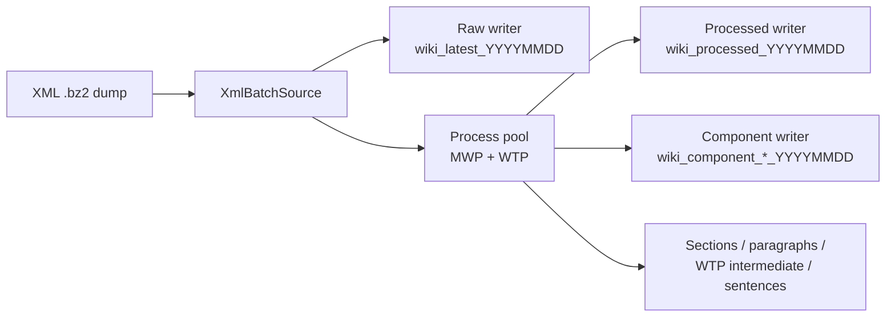

# Wikipedia Parser

将 Wikipedia XML dump 单遍读取、解压和解析，并把原始版本记录与结构化解析结果并行写入 SQL Server。输入文件名中的八位日期会成为输出表名后缀，例如 `simplewiki-20260901-pages-articles.xml.bz2` 默认写入 `wiki_latest_20260901`、`wiki_processed_20260901` 和 `wiki_component_*_20260901`。



详见 [架构与容错](docs/architecture.md)、[函数级、句级开发指南](docs/development-guide.md) 和[按命令流学习项目](docs/command-flow-learning-guide.md)。

## Installation

项目要求 Python 3.10 或更高版本。根目录的 `requirements.txt` 安装解析器直接依赖及本地 `wikitextprocessor`；直接依赖包括 `mwxml`、`mwparserfromhell`、`pymssql`、`tqdm` 和 `sentencex`。

在项目根目录执行：

```powershell
python -m pip install --no-build-isolation -r requirements.txt
```

`--no-build-isolation` 使本地 `wikitextprocessor` 复用当前环境的 setuptools；在镜像无法下载构建依赖时尤其需要它。

## Database Configuration

复制示例配置并填写 SQL Server 连接信息：

```powershell
cd .\Wikipedia-Parser-dev
Copy-Item .\config.example.json .\config.json
```

当前代码使用统一配置文件 `config.json`，而不是独立的 `db_config.json`。常用字段如下：

```json
{
  "sqlserver": {
    "host": "10.0.0.10",
    "port": 1433,
    "user": "sa",
    "password": "CHANGE_ME",
    "database": "wiki",
    "schema": "dbo",
    "table": "wiki_latest"
  },
  "source": {
    "dump_file": "../WikiData/simplewiki-20260901-pages-articles.xml.bz2"
  },
  "wtp": {
    "lang_code": "en",
    "project": "wikipedia",
    "expand_timeout": 60,
    "read_only": true,
    "wikidata_offline": true
  }
}
```

`host`、`user`、`password`、`database` 和 `source.dump_file` 必填；`port` 默认 1433。`schema` 建议显式指定为 `dbo`。`sqlserver.table` 是原始表的基础名，未设置时为 `wiki_latest`；所有 XML 输出表都会附加 `_YYYYMMDD`。不要提交真实的 `config.json`。

## Usage

使用配置中的 dump：

```powershell
python .\wikipedia_parser.py --config .\config.json
```

也可用位置参数覆盖配置中的 dump，并先处理少量页面验证连接与表结构：

```powershell
python .\wikipedia_parser.py ..\WikiData\simplewiki-20260901-pages-articles.xml.bz2 --config .\config.json --max-pages 100
```

运行时会显示四个独立进度条：

- `Read`：从 XML 读取的记录数。
- `Parse`：已由进程池完成解析的记录数。
- `Write`：已写入 processed 及其派生结果的记录数。
- `Raw`：已写入原始表的记录数。

`--max-pages` 仅限制物理 XML 扫描页数，适合连通性和表结构验证；省略时处理整个 dump。

| 参数 | 说明 |
| --- | --- |
| `dump_file` | 可选位置参数，覆盖 `source.dump_file`。 |
| `--config PATH` | 必填，统一 JSON 配置文件。 |
| `--processed-table NAME` | processed 表基础名，默认 `wiki_processed`。 |
| `--table-prefix NAME` | 组件表前缀，默认 `wiki_component`。 |
| `--sections-table` / `--paragraphs-table` | 层次表基础名。 |
| `--wtp-intermediate-table` / `--sentences-table` | WTP 中间表、句子表基础名。 |
| `--workers N` | 解析进程数；默认 CPU 核心数。 |
| `--chunk-size N` / `--write-batch N` | XML 读取批大小和数据库写入批大小，默认均为 500。 |
| `--max-pages N` | 最大扫描页数。 |
| `--namespace ID` | 可重复指定的命名空间；默认仅 `0`。 |
| `--all-namespaces` | 覆盖 `--namespace`，处理全部命名空间。 |
| `--task-timeout SEC` | 单批解析等待上限，默认 300；`0` 禁用。 |
| `--db-timeout SEC` / `--db-login-timeout SEC` | 查询和登录超时。 |
| `--resume` / `--no-resume` | 是否使用 checkpoint 跳过已终态修订版；默认启用。 |
| `--retry-errors` | resume 时重新处理 `completed_with_errors` 修订版。 |
| `--checkpoint-table NAME` | checkpoint 表基础名，默认 `wiki_parse_checkpoint`。 |

## Processed Table and Component Tables

默认仅处理 ns=0 文章。每篇文章在 `wiki_processed_YYYYMMDD` 中有一行，包含 `revision_id`、页面信息、`text_process` 和 `parse_error`。`text_process` 会以组件 ID 占位符替换已提取组件；普通 wikilink 则保留原始 `[[...]]` 形式。

当前实现有 8 类组件表：`infobox`、`table`、`independent_template`、`wikilinks`、`external_links`、`file`、`image`、`ref`。每张表都有统一的 `page_id`、`<type>_id`、`<type>_text` 结构；组件 ID 格式为 `<type>-<page_id>-<seq>`。`file` 与 `image` 分表，列表不产生独立组件表。

processed 表按 `revision_id` 使用 `MERGE` upsert。组件表和层次表采用“按本批页面/修订版删除后再插入”的方式，使内容变化后不会遗留陈旧行；它们不是 append-only 表。

解析异常仍会保留 processed 行，`parse_error` 非空。检查失败记录示例：

```sql
SELECT revision_id, page_id, page_title, parse_error
FROM dbo.wiki_processed_20260901
WHERE parse_error IS NOT NULL
ORDER BY revision_id;
```

逐条失败详情另写入 `logs/parser-*.log`，避免大量失败记录刷屏终端。

## Code Structure

```text
wikipedia_parser.py        CLI、配置加载与 writer 编排
pipeline/xml_source.py     XML 流式批源与原始表 writer
pipeline/engine.py         组件提取、WTP 调用、数据库 writers 与 _run_core
pipeline/pipeline_config.py 统一配置和版本化表名
pipeline/wtp_integration.py 进程内 WTP 初始化及文本展开
pipeline/*_extractor.py    section、paragraph、sentence 提取
pipeline/checkpoint.py     SQL Server checkpoint 持久化
tests/                     单元与回归测试
docs/                      架构与开发指南
```

`engine._run_core` 只依赖批源 iterable 和 writer 的 `add_rows` / `close` 协议，因此 XML 来源和输出端可以分别替换。`FanoutWriter` 把同一批解析 bundle 分发到 processed、组件和层次 writer。
