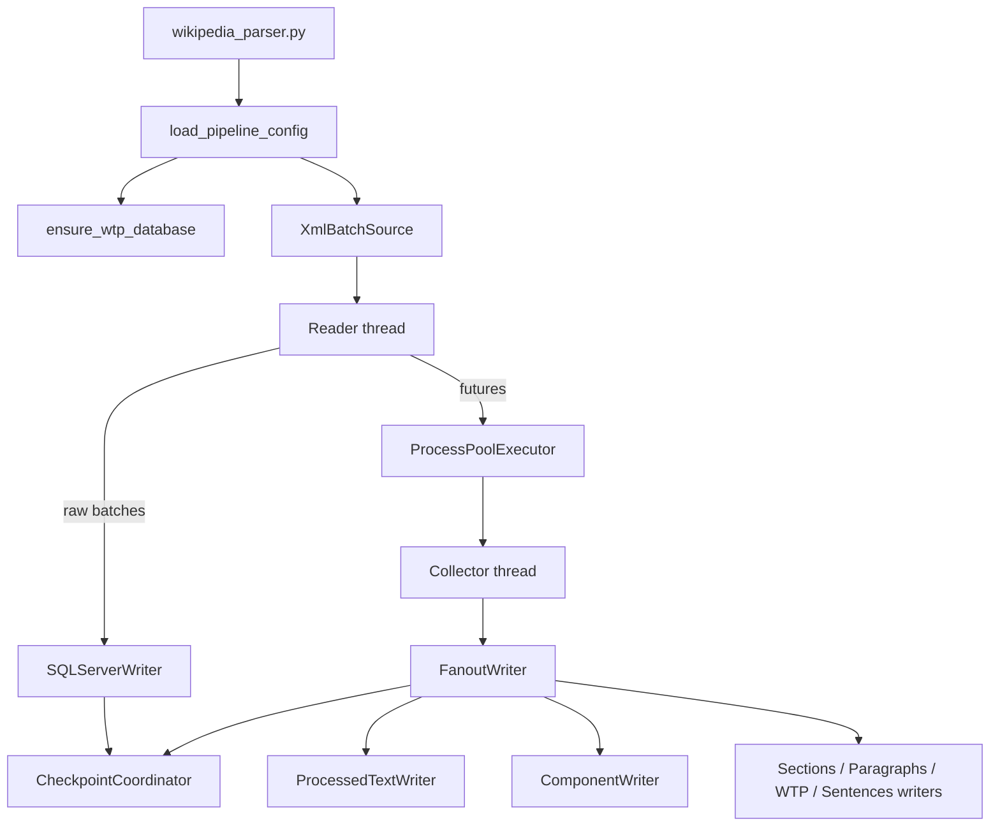

# 架构与容错

## 数据流

`wikipedia_parser.py` 解析 CLI 和统一配置，解析输入 dump 的日期后缀，并在启动 worker 前调用 `ensure_wtp_database`。缺失的同版本 WTP SQLite 数据库会从 XML 自动构建；存在则复用。

## 并发和背压

`engine._run_core` 使用 reader、collector、writer 线程和 `ProcessPoolExecutor`。读取、解析和写入队列都是有界队列；下游变慢时上游会阻塞，避免把完整 dump 堆积在内存中。原始写入启用时有独立 `raw-writer` 线程，因此终端显示 `Read`、`Parse`、`Write`、`Raw` 四个进度条。

worker 在进程内独立创建 WTP/Lua 状态，避免跨进程共享可变解析器状态。每个 batch 可通过 `--task-timeout` 触发超时中断；查询和登录超时分别由 `--db-timeout` 与 `--db-login-timeout` 控制。

## 结果和写入语义

每条输入记录在 worker 中转换为一个 bundle：processed 字段、按类型归类的组件、sections、paragraphs、WTP 中间结果和 sentences。`FanoutWriter` 将 bundle 广播给所有派生 writer。

- `ProcessedTextWriter` 以 `revision_id` 为键执行 MERGE upsert。
- 组件 writer 对本批涉及页面删除后重插，保证组件消失时旧行也被移除。
- sections、paragraphs、WTP intermediate、sentences 对本批修订版删除后重插。
- 建表约束名包含物理表名，允许不同 dump 日期的版本表在同一 schema 共存。

## 失败和恢复

单篇解析异常不会停止全局导入：bundle 会以空的派生集合及非空 `parse_error` 写入 processed 表，失败详情写入本次运行的 `logs/parser-*.log`。管线级错误（例如任务超时、写入失败）会停止后续提交并优先传播首个根因；清理阶段错误不会掩盖该根因。

启用 resume 时，`SQLServerCheckpointStore` 保存每条修订版的终态。`CheckpointCoordinator` 只有在同一 batch 的原始表与 processed 分支均提交后才标记 checkpoint，避免恢复时跳过只写入了一半的数据。`--retry-errors` 可让 `completed_with_errors` 的修订版重新进入管线。
