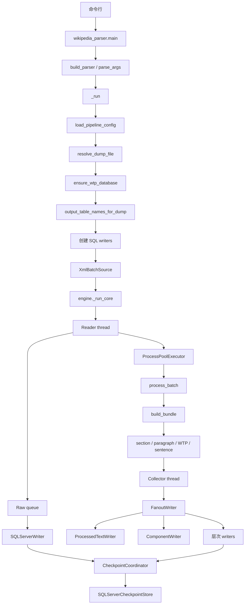

# 按命令流学习 Wikipedia Parser

这是一份从“敲下一条命令”开始阅读项目的学习文档。它不按文件名孤立地介绍代码，而是按运行时真正发生的顺序解释：命令如何进入程序、XML 如何变成 batch、文章如何被解析为句子，以及数据怎样安全写入 SQL Server。

阅读目标有两个：

1. 能够沿着一次运行定位任意阶段的代码。
2. 能够在修改组件、句子规则或 writer 前判断影响范围。

## 1. 先看项目树

```text
Wikipedia-Parser-dev/
├── wikipedia_parser.py          # 主命令入口
├── config.example.json          # 统一配置模板
├── pipeline/
│   ├── pipeline_config.py       # 读取配置、生成版本化表名
│   ├── wtp_database.py          # 为 XML 准备同版本 WTP SQLite DB
│   ├── xml_source.py            # 流式 XML 读取和原始表写入
│   ├── engine.py                # 解析、并发调度和所有派生 writer
│   ├── section_extractor.py     # wikitext → section
│   ├── paragraph_extractor.py   # section → paragraph
│   ├── sentence_extractor.py    # paragraph → sentence
│   ├── wtp_integration.py       # WTP/Lua 的 worker 级封装
│   ├── checkpoint.py            # resume 状态持久化
│   └── run_logging.py           # 本次运行的失败日志文件
├── tests/                       # 单元和回归测试
├── bench/                       # 性能基准脚本，不参与正常导入
└── docs/                        # 架构、开发与学习文档
```

首次学习时，优先顺序是：`wikipedia_parser.py` → `pipeline_config.py` → `wtp_database.py` → `xml_source.py` → `engine.py` → 三个 extractor。不要一开始从 `engine.py` 顶部顺序读到末尾；它负责许多不同层面的工作。

## 2. 从一条命令开始

在 `Wikipedia-Parser-dev/` 中，典型命令为：

```powershell
python .\wikipedia_parser.py ..\WikiData\simplewiki-20260901-pages-articles.xml.bz2 --config .\config.json --max-pages 100
```

这条命令的含义逐句拆开如下：

- `python` 启动解释器。
- `wikipedia_parser.py` 是主程序，不是单独的库模块。
- 第一个位置参数是 XML dump。提供它时，它会覆盖配置文件中的 `source.dump_file`。
- `--config` 指向统一配置。SQL Server、WTP 和默认输入都来自这个文件。
- `--max-pages 100` 只扫描前 100 个 XML `<page>` 元素，适合预检。它不保证 Parse 或 Write 条数正好是 100，因为命名空间和 resume 会继续过滤记录。

若省略位置参数，程序使用 `config.json` 的 `source.dump_file`：

```powershell
python .\wikipedia_parser.py --config .\config.json
```

## 3. 全项目运行流程图



图中有两条并行输出：原始 XML 记录进入 `SQLServerWriter`；解析后的 bundle 进入 `FanoutWriter`。只有两个分支都提交时，checkpoint 才会把该 batch 标为完成。

## 4. 阶段一：主入口 `wikipedia_parser.py`

### 4.1 导入阶段

文件开头把 `pipeline/` 放到 `sys.path` 首位。

这一步使主进程和 Windows spawn 出来的子进程都能按模块名重新导入 `engine`。

随后主文件导入配置、WTP 数据库、XML source、checkpoint 和日志模块。

### 4.2 `build_parser()`：定义命令边界

`build_parser()` 只定义参数，不执行导入。

最重要的参数是可选的 `dump_file` 和必填的 `--config`。

表基础名参数包括 `--processed-table`、`--table-prefix`、四张层次表参数以及 `--checkpoint-table`。

运行参数包括 `--workers`、`--chunk-size`、`--write-batch`、`--max-pages`、超时和 resume 参数。

默认仅处理 namespace `0`。`--namespace` 可重复给出。`--all-namespaces` 会取消该限制。

### 4.3 `main()`：每次运行的外壳

`main()` 先调用 `start_run_log(...)`。

该调用在 `logs/` 下创建一个带时间和 PID 的空日志文件。

主程序会先把日志路径打印出来，再调用 `parser.parse_args()`。

最后无论成功、参数报错或异常，`finally` 都会关闭日志句柄。

### 4.4 `_run()`：把配置变成运行对象

`_run()` 是主文件真正的编排函数。

它先检查配置文件是否存在。

它调用 `load_pipeline_config()` 得到 SQL Server 配置、WTP 配置和默认 dump 路径。

它调用 `resolve_dump_file()`，让命令行输入优先于配置输入。

它检查 dump 文件存在后调用 `ensure_wtp_database()`。

这个调用的返回值会写进 `wtp_settings["db_path"]`，之后每个解析 worker 都打开同一版本的只读 WTP DB。

参数校验在此处尽早完成。例如 worker、chunk 和写入 batch 必须大于零；任务超时可以为零，表示禁用。

`output_table_names_for_dump()` 从 dump 文件名提取日期，生成如 `wiki_processed_20260901` 的物理表名。

接着 `_run()` 创建 raw、processed、component、section、paragraph、WTP intermediate 和 sentence writer。

这些派生 writer 被放入一个 `FanoutWriter`。一次 `add_rows()` 会广播同一个 batch bundle。

最后 `_run()` 构造 `XmlBatchSource`，可选地用 `SkippingBatchSource` 包装它，再调用 `engine._run_core()`。

## 5. 阶段二：配置和 WTP 数据库

### 5.1 `pipeline/pipeline_config.py`

`load_pipeline_config(config_path)` 打开 JSON，并验证顶层 `sqlserver`、`source` 和 `wtp` 都是对象。

SQL Server 中的 `host`、`user`、`password`、`database` 必填。

`source.dump_file` 必填，并且相对于配置文件本身解析，而不是相对于当前终端目录解析。

`load_wtp_settings()` 位于 `wtp_integration.py`。它填充语言、项目、展开超时、只读和离线默认值。

`output_table_names_for_dump()` 要求 XML 文件名带独立的八位日期。

它给 raw、processed、components、层次表和 checkpoint 使用同一个 `_YYYYMMDD` 后缀。

### 5.2 `pipeline/wtp_database.py`

`wtp_database_path_for_dump()` 把 `name.xml.bz2` 映射为 `name-wtp-full.db`。

`ensure_wtp_database()` 先检查该 DB 文件是否存在。

存在时立即返回，因此正常解析不会重复导入模板和 Lua 模块。

不存在时，它调用 `build_wtp_database()`。

`build_wtp_database()` 使用临时文件创建 SQLite DB，再调用 `wikitextprocessor.dumpparser.process_dump()` 导入 namespace `0`、`10`、`828`。

这三个 namespace 分别覆盖文章、模板和 Lua 模块。

导入成功后临时文件通过 replace 原子地成为正式 DB；导入失败时临时文件会删除。

如果只想从 `WikiData/` 创建或复用 WTP DB，可运行父目录的 `build_wtp_database.py`；它只是调用这里的 `ensure_wtp_database()`。

## 6. 阶段三：XML 如何产生 batch

### 6.1 `pipeline/xml_source.py` 的 `XmlBatchSource`

`XmlBatchSource` 接收 dump 路径、`chunk_size`、`max_pages` 和命名空间集合。

它用 `mwxml` 流式迭代 page，不把整个压缩包装入内存。

每个 page 只取最新 revision，并由 `build_latest_record()` 统一整理为字典。

字典包含解析所需的 revision、page、标题、namespace、模型和内容字段。

满足命名空间条件的记录积累到 `chunk_size` 后 yield 一个 list。

文件扫描结束时，未满的一批也会 yield。

### 6.2 `SkippingBatchSource`

resume 启用时，主程序从 checkpoint 读取已终态 revision ID。

`SkippingBatchSource` 在 batch 到达进程池前过滤这些 ID。

它记录跳过数量，最终摘要会显示 `skipped_terminal`。

### 6.3 `SQLServerWriter`

raw writer 接收与进程池相同的原始 batch。

它负责创建和写入原始表。

这条路径不等待解析完成，因此 XML 读取、原始写入和解析可以重叠执行。

## 7. 阶段四：`engine._run_core()` 的并发骨架

`_run_core()` 的输入不是固定的 XML 类，而是“产生 `list[dict]` 的 iterable”。

因此测试可以传入普通列表，未来也可以替换成其他来源。

它创建三条有界队列：futures 队列、派生结果写入队列，以及可选的 raw 队列。

队列容量与 worker 数关联。一个阶段变慢时，上游 `put` 会等待。这就是背压。

### 7.1 Reader thread

reader 遍历 batch source。

它把同一 batch 同时放入 raw 队列和进程池。

它保存 future、revision key 和 batch ID 到 futures 队列。

它更新 `Read` 进度条。

### 7.2 ProcessPoolExecutor

每个 worker 通过 `initialize_wtp_worker()` 打开独立 WTP 实例。

reader 提交的函数是 `process_batch(rows, expand_timeout)`。

进程间只传递普通字典、字符串、数字和 dataclass 能承载的数据，避免传递数据库连接或 WTP 对象。

### 7.3 Collector thread

collector 按提交顺序等待 future。

`wait_result()` 用短轮询等待 future，并检查 `--task-timeout`。

超时时，它写出包含 revision 范围的诊断，强制回收 worker，并使整条管线停止。

正常返回的 `BatchResult` 包含 records、失败列表和 paragraph 统计。

每条失败记录会通过 `failure_logger` 写入当前运行日志，而不是逐条打印终端。

collector 再把 records 放入派生写入队列，并更新 `Parse` 进度条。

### 7.4 Writer 与清理

writer thread 取出 records 并调用 `FanoutWriter.add_rows()`。

raw writer thread 同理写入原始记录。

每个阶段异常都通过 `fail()` 保存第一个根因，并设置 stop event。

退出时 `_run_core()` 关闭进程池、所有 writer、source 和进度条。

清理异常会被收集；如果已有主异常，主异常优先传播。

## 8. 阶段五：一篇文章在 worker 内如何变成 bundle

`process_batch()` 循环调用 `build_bundle()`，并把 bundle 放入 `BatchResult.records`。

`build_bundle()` 包住整篇文章的解析异常。

某篇文章出错时，函数仍返回该文章的基础字段，但派生集合为空且 `parse_error` 非空。

这使数据库中能看见失败文章，而不是静默丢失它。

### 8.1 `section_extractor.py`

`extract_sections(wikitext, page_id)` 把 wikitext 依标题切成 `Section`。

每个 `Section` 记录 section 编号、标题路径、原始文本和处理后文本。

没有标题的开头正文也会成为一个 section。

### 8.2 `component_extractor.extract_and_templatize()`

这个函数使用 `mwparserfromhell` 识别组件。

infobox、HTML table、独立模板、ref、外链、file、image 会被替换为内部占位符。

占位符内保存稳定的组件 ID，例如 `ref-123-2`。

普通 `[[Target]]` 不替换。它留在 `text_process` 中，以便句级阶段再做链接展示转换。

`remove_format_blocks()` 随后清理应整体移除的格式块，并同步移除不再出现在文本内的组件记录。

### 8.3 `paragraph_extractor.py`

`extract_paragraphs(sections, page_id)` 以空行和子标题拆分 section。

输出的 `Paragraph` 继承 section 编号、段落编号和 toc 路径。

它保留 `raw_wikitext`，也给 WTP 处理后的 text、输入和错误预留字段。

### 8.4 `wtp_integration.py`

`begin_page(page_title)` 先在 WTP 上开始页面上下文。

`analyze_wikitext()` 运行 WTP 分析并返回错误信息而不是直接中断。

`expand_to_text()` 展开模板和 Lua，再将扩展结果转换为可见文本。

`expanded_wikitext_to_text()` 处理 HTML、文件链接和不可见标记，产出面向句级处理的文本。

参考文献、外部链接等命中的 toc 会跳过 WTP 展开。它们的 paragraph 仍写入表，但不进入 WTP intermediate 和 sentence writer。

## 9. 阶段六：句级处理逐句学习

句级入口是 `sentence_extractor.extract_sentences(paragraphs, page_id, lang, skip_tocs)`。

它返回 `Sentence` 对象列表。每个对象包含 `section_no`、`paragraph_no`、`sentence_no`、`toc`、`raw_text` 和最终 `text`。

### 9.1 第一句：清理 ref 占位符

`_remove_ref_placeholders()` 在分句之前移除已被抽到 ref 表的占位符。

这样参考文献内容不会让 sentencex 错把 `.` 当成正文句末。

### 9.2 第二句：合并冒号引导的列表

如果前一个 paragraph 以 `:` 或 `：` 结尾，且下一个 paragraph 只含列表项，`extract_sentences()` 先把两者合并。

这保证“包括：”不会与其后的列表分成毫无关系的两个句子。

### 9.3 第三句：保护列表内部标点

`_prepare_lists_for_segmentation()` 识别以 `*`、`#`、`;`、`:` 开头的连续行。

`_render_list_block()` 和 `_render_list_item()` 把嵌套列表折叠为结构化的单段文本。

函数再用不透明 token 代替整块列表，并额外补一个句点。

token 使列表项内部的句点、分号不会被 sentencex 拆成多句。

分句之后，`_restore_list_tokens()` 把真实列表文本放回去。

### 9.4 第四句：调用 sentencex 或回退

常规段落调用 `sentencex.segment(lang, text)`。

sentencex 抛异常时，代码把整个 paragraph 当作一条 sentence。

如果 segmentation 返回空结果，代码同样补回整段。

这两个回退分支是数据完整性保护，不要轻易删除。

### 9.5 第五句：跳过的 toc

`skip_tocs` 由 engine 传入。

标题与集合中的项相等，或以 `项:` 开头时，paragraph 不分句。

该 paragraph 原样成为一句，并且不调用 `_process_wikilinks()`。

这是避免参考文献和外部链接文本被当成自然语言改写的规则。

### 9.6 第六句：格式化 wikilink

普通段落的每个 segment 最后经过 `_process_wikilinks()`。

`[[Target]]` 变为 `[[Target↓Target]]`。

`[[Target|显示文本]]` 变为 `[[显示文本↓Target]]`。

含多个 `|`、空目标或空显示文本的链接保持原样，避免猜测复杂 MediaWiki 语义。

`sentence_no` 只在 section 内递增。它跨 paragraph 连续，但新 section 从 1 重新开始。

## 10. 阶段七：写入数据库

`ProcessedTextWriter` 将每个 bundle 的基础字段组成行。

它以 `revision_id` 为匹配条件执行 SQL Server `MERGE`，所以重复运行同一 revision 会更新而不是重复插入。

`ComponentWriter` 为八种组件各维护一个缓冲区。

写入前它删除本 batch 涉及页面的旧组件，再插入当前组件。页面本次没有某种组件时，旧组件也会被删除。

`SectionsWriter`、`ParagraphsWriter`、`WtpIntermediateWriter` 和 `SentencesWriter` 使用相同的“删除该 revision，再插入当前结果”思想。

这些 writer 的唯一约束名带有物理表名，保证不同日期版本表可以在同一 schema 创建。

## 11. 阶段八：日志和 checkpoint

`run_logging.start_run_log()` 为一次运行创建唯一日志文件。

collector 发现文章失败时调用 `RunLogSession.write_parse_failure()`。

该方法加锁、追加一行并立即 flush，因此多个线程的失败记录不会交错。

resume 相关逻辑在 `checkpoint.py`。

`source_id_for_path()` 依据输入路径创建稳定的 source ID。

`SQLServerCheckpointStore` 读取和写入 revision 的终态。

`CheckpointCoordinator` 记录 raw 与 processed 分支各自已提交的 batch ID。

它只有在两个集合都确认同一 batch 后，才调用 `mark_terminal()`。

## 12. 辅助文件如何阅读

`tests/test_unified_config.py` 适合先理解配置、CLI 参数和版本化表名。

`tests/test_wtp_database.py` 说明缺失 DB 如何构建、已有 DB 如何复用和失败如何清理临时文件。

`tests/test_checkpoint.py` 说明为什么 raw 和 processed 必须共同确认才能 checkpoint。

`tests/test_sentence_wikilinks.py`、`tests/test_list_pipeline.py`、`tests/test_skip_wtp_sections.py` 是修改句级规则前最应先运行的测试。

`bench/read_parse.py` 与 `bench/write_latency.py` 是性能测量工具。它们不在主命令路径中。

## 13. 推荐学习与调试顺序

1. 用 `--max-pages 1` 运行一次，观察四个进度条和日志文件路径。
2. 阅读本文件第 4 节和 `wikipedia_parser.py` 的 `main()`、`_run()`。
3. 阅读第 6、7 节，并在 `engine._run_core()` 中对应 reader、collector、writer 三个内部函数。
4. 选择一篇文章，沿着第 8、9 节查看它从 wikitext 到 sentence 的字段变化。
5. 最后阅读 writer 和 checkpoint；它们决定重跑时是否安全。

当你准备修改某个规则时，先定位它属于“输入读取、文章解析、句级转换、写入、恢复”中的哪一层。只修改那一层的最小函数，并先运行该层对应测试，再运行完整测试集。
